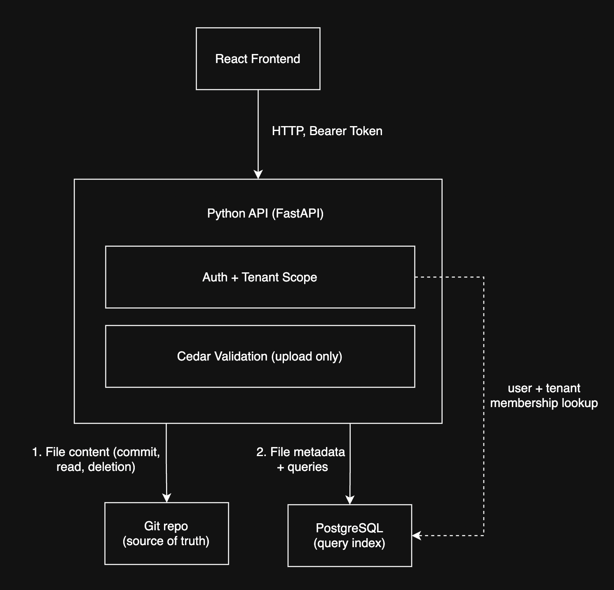

# SmartVerify Design Document

## High Level Architecture Diagram

## Sequence Diagram (uploading a file)

User -> API: POST /tenants/{tenant_id}/policies (+ token, file)

API -> Postgres: resolve user, check tenant_id is in user's tenants -- fails -> 403

API -> API: validate filename pattern -- fails -> 400

API -> Cedar: parse policy -- fails -> 400 + parser message

API -> Postgres: check (tenant_id, filename) not taken -- taken -> 409

API -> Git: write to {customer}/{tenant}/{file}, commit -> SHA

API -> Postgres: INSERT metadata row (incl. commit SHA)

API -> User: 201 + metadata
